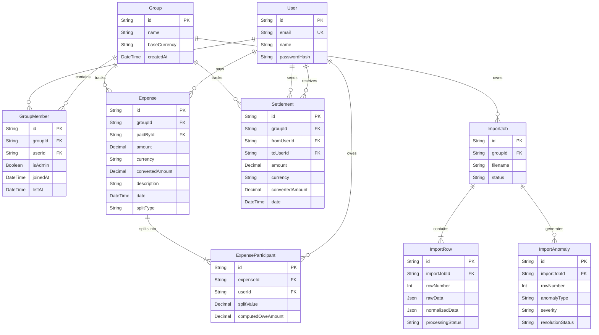

# System Architecture

The Shared Expenses App backend is built on a modern Node.js, Express, and Prisma stack. It uses a service-oriented architecture to enforce separation of concerns between HTTP transport, business logic, and database access.

## 1. Request Flow
1. **Client Request**: An HTTP request hits the Express server.
2. **Global Middleware**: Parsers (e.g., `express.json()`) process the payload.
3. **Authentication Middleware**: `authenticateJWT` verifies the token.
4. **Validation Middleware**: `validateRequest` uses Zod to ensure the request body perfectly matches the expected DTO. Returns `400 Bad Request` if invalid.
5. **Authorization Middleware**: If required, `authorizeGroupAdmin` queries the database to ensure the user is an admin of the specified group.
6. **Controller**: The Express controller receives the sanitized request, extracts parameters, and calls the appropriate Service.
7. **Service**: Contains pure business logic. It calls one or more Repositories.
8. **Repository**: Uses the Prisma Client to interact with the PostgreSQL database.
9. **Response**: Data flows back up the chain and is returned as JSON to the client.

## 2. Authentication Flow
1. User submits `email` and `password` to `POST /auth/login`.
2. `AuthController` calls `AuthService.login`.
3. The service fetches the user via `UserRepository`.
4. It verifies the password against the `passwordHash` using a timing-safe comparison.
5. A JSON Web Token (JWT) is signed using the `JWT_SECRET`, encoding the `userId`.
6. The token is returned to the client and must be passed as `Authorization: Bearer <token>` in subsequent requests.

## 3. Import Flow
1. **Upload**: Admin posts a CSV file to `POST /groups/:groupId/imports/upload`.
2. **Parsing**: Multer captures the file in memory. `CsvParserService` normalizes headers and converts rows to JSON.
3. **Staging**: An `ImportJob` is created. Each parsed row is saved to `ImportRow`.
4. **Analysis**: `AnomalyDetectionService` scans every row against 12 business rules (e.g., missing data, bad dates, inactive members).
5. **Flagging**: Detected issues are saved as `ImportAnomaly` records. The job status becomes `PENDING_REVIEW` if anomalies exist.

## 4. Finalization Flow
1. **Trigger**: Admin calls `POST /groups/:groupId/imports/:id/finalize`.
2. **Locking**: The job `status` is updated to `FINALIZING` via an atomic query to prevent concurrent runs.
3. **Transaction**: A Prisma `$transaction` begins.
4. **Pre-check**: Aborts if any `ImportAnomaly` is still `PENDING`.
5. **Resolution**: Iterates over `ImportRow`s. Applies `APPROVED` resolutions (mutating `normalizedData`). Skips rows with `REJECTED` anomalies.
6. **Persistence**: Creates `Expense` or `Settlement` records based on the resolved row data.
7. **Commit**: If successful, updates job to `COMPLETED` and commits transaction. If an error is thrown, the transaction rolls back, and the application layer updates the job to `FAILED`.

## 5. Balance Calculation Flow
1. **Trigger**: Client requests `GET /groups/:groupId/simplified-balances`.
2. **Aggregation**: `BalanceService` fetches all `Expenses` (and their `ExpenseParticipants`) and `Settlements` for the group.
3. **Net Balances**: Calculates `Net = (Paid - Owed) + (SettlementsPaid - SettlementsReceived)` for each user.
4. **Simplification (Greedy Algorithm)**:
   - Separates users into Debtors (Net < 0) and Creditors (Net > 0).
   - Sorts both lists by amount.
   - Matches the largest debtor with the largest creditor to generate a "Settlement Suggestion".
   - Subtracts the matched amount from both.
   - Repeats until all balances are zero.

## 6. Database Relationship Diagram

